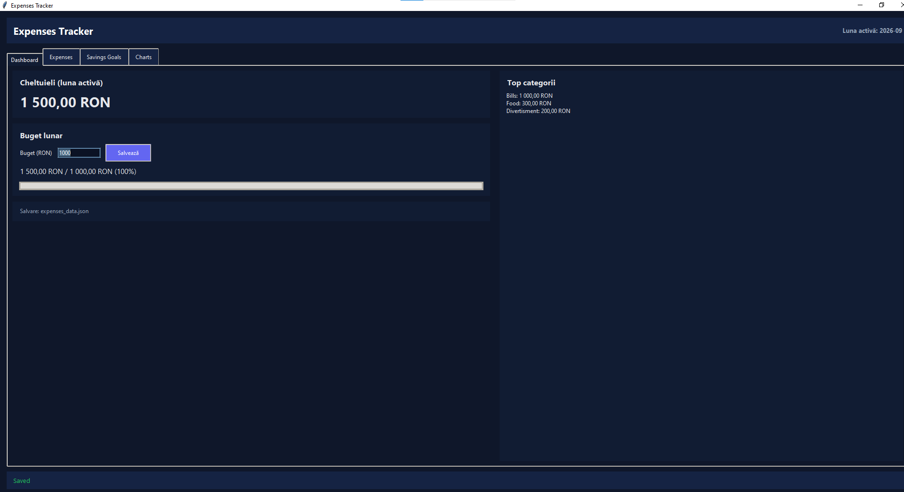
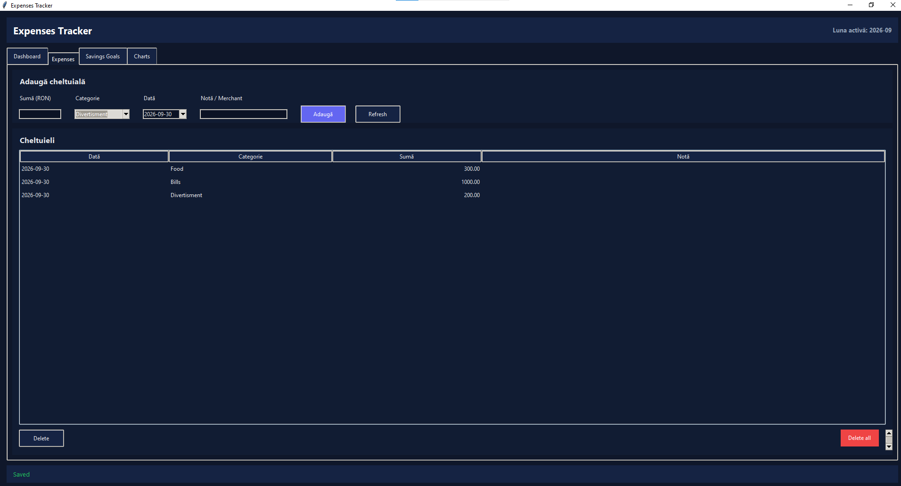
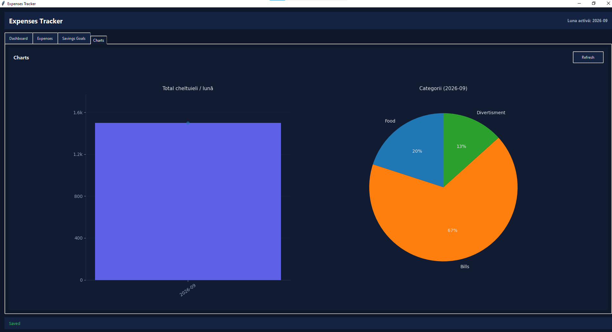

# Personal Expenses & Savings Tracker

A desktop GUI application built in Python using Tkinter and Matplotlib for tracking expenses, managing monthly budgets, and monitoring savings goals.

## Screenshots

### Dashboard & Analytics


### Expense Management


### Visual Charts


## Features
- **Dashboard:** Monthly total spend, budget progress bar, and category breakdown.
- **Expense Management:** Add, list, and delete expenses categorized by spending type.
- **Savings Goals:** Set target amounts and track progress over time.
- **Visual Analytics:** Real-time monthly trend bars and expense distribution pie charts.
- **Safe Storage:** Atomic JSON persistence mechanism.

## Setup & Execution

1. Install requirements:
```bash
pip install -r requirements.txt